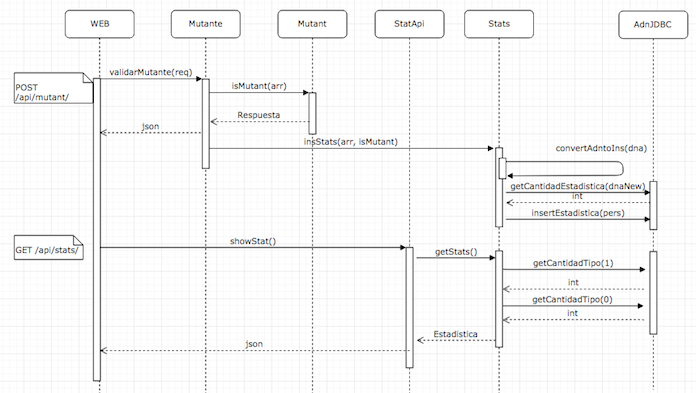

# Ejercicio Mer. Lib. Nivel 3 (Agosto 2019)
###### Autor: [Manuel Moya - mmoyam@gmail.com]
El objetivo de este documento es detallar la resolución del caso Mer. Lib. Nivel 3, donde se debe crear una API y desplegarlo en un servicio Cloud. Esto basado en el algortimo que detecta mutantes basados su secuencia de ADN del ejercicio anterior [(Nivel 1)](https://github.com/manumoya/MerLibNiv1/) y en la API /mutant/ publicada en [(Nivel 2)](https://github.com/manumoya/MerLibNiv2/).

### Enunciado

* Anexar una base de datos, la cual guarde los ADN’s verificados con la API.
* Solo 1 registro por ADN.
* Exponer un servicio extra “/stats” que devuelva un Json con las estadísticas de las verificaciones de ADN:
 
		{“count_mutant_dna”:40, “count_human_dna”:100, “ratio”:0.4}

* Tener en cuenta que la API puede recibir fluctuaciones agresivas de tráfico (Entre 100 y 1 millón de peticiones por segundo).
* Test-Automáticos, Code coverage > 80%
* Diagrama de Secuencia 
* Arquitectura del sistema.

### Entregables

* Código Fuente en repositorio github.
* Instrucciones de cómo ejecutar el programa o la API. 
* URL de la API.
* Documento en PDF.
* Dirgrama secuencia
* Diseño arquitectura

### Idea principal

* Tomar la solución [(Nivel 2)](https://github.com/manumoya/MerLibNiv2/) y agregar la Api para estadisticas.
* Usar base de datos MySql (servicio Azure).
* Crear DAO y procesos relacionados para que inserte y obtenga estadisticas.
* Explicar la forma de escalar la API.

### Supuestos
* No hay supuestos adicionales

### Descripción del programa

El programa considera los siguientes Packages

* **com.merlib.dao**: Contiene los programas que harán el acceso a la BD.
* **com.merlib.models**: Contiene los java beans utilizados.
* **com.merlib.process**: Contiene los programas que tienen algun proceso de negocio.
* **com.merlib.services**: Contiene los programas que habilitan la APIs.

Los programas son los siguientes:

* **com.merlib.dao**: 
	* [AdnJDBC.java](https://github.com/manumoya/MerLibNiv3/tree/master/src/main/java/com/merlib/dao/AdnJDBC.java) 
	
* **com.merlib.models**: 
	* [Estadistica.java](https://github.com/manumoya/MerLibNiv3/tree/master/src/main/java/com/merlib/models/Estadistica.java) 
	* [Persona.java](https://github.com/manumoya/MerLibNiv3/tree/master/src/main/java/com/merlib/models/Persona.java)
	* [Respuesta.java](https://github.com/manumoya/MerLibNiv3/tree/master/src/main/java/com/merlib/models/Respuesta.java)
* **com.merlib.process**: 
	* [Mutant.java](https://github.com/manumoya/MerLibNiv3/tree/master/src/main/java/com/merlib/process/Mutant.java)
	* [Stats.java](https://github.com/manumoya/MerLibNiv3/tree/master/src/main/java/com/merlib/process/Stats.java)
* **com.merlib.services**: 
	* [Mutante.java](https://github.com/manumoya/MerLibNiv3/tree/master/src/main/java/com/merlib/services/Mutante.java)
	* [StatApi.java](https://github.com/manumoya/MerLibNiv3/tree/master/src/main/java/com/merlib/services/StatApi.java)

### Pruebas automáticas

Las pruebas unitarias que cubren son:
 
* [MutantTest.java](https://github.com/manumoya/MerLibNiv3/tree/master/src/test/java/com/merlib/process/MutantTest.java).
* [AdnJDBCTest.java](https://github.com/manumoya/MerLibNiv3/tree/master/src/test/java/com/merlib/dao/AdnJDBCTest.java).
* [StatsTest.java](https://github.com/manumoya/MerLibNiv3/tree/master/src/test/java/com/merlib/process/StatsTest.java).

Adicionalmente, las API se probaron directamente con Postman y Jmeter.

#### Traza
Los casos probados fueron los mismos casos de Nivel 1 y Nivel 2. Traza de estadísticas.

|Caso 1  |
|---|
|  |  

### Diagrama de secuencia

A continuación se puede ver el diagrama de secuencia de la solución:

### Arquitectura del sistema

Las arquitectura del sistema de una instanciaa es el siguiente, se debe considerar que la aplicación y la BD están en maquinas diferentes:

#### Escalabilidad

Si la necesidad es escalar la solución, se debe considerar la siguiente arquitectura, donde se debe configurar un load balancer y configurar las instancias de servidor de aplicación y BD necesarias. Por ejemplo, si con la herramienta de performance se determina que cada servidor responde 1.000 req/seg, para responder 1 millón, se necesitan configurar al menos 1.000 instancias balanceadas.

 
### Tecnología utilizada
* java 7.*
* Jersey 2.* (api framework)
* Junit 4.*
* Azure Cloud
* Linux Server
* Apache Tomacat 8.*
* Deploy basado en GitHub
* Postman (request client)
* Apache Jmeter 3.* (Performance tool)
* Maven (construcción y gestión del proyecto)
* BD MySql
* MAC OS X 	

### ¿Se puede mejorar?

* Sí, agregando persistencia de BD como Hibernate.
* Implementando la escalanbilidad correspondiente.
* Agregando un cluster de BD

### Ejecución del programa

* La url de la API es: [https://merlibniv3.azurewebsites.net](https://merlibniv3.azurewebsites.net/). Se debe considerar que la aplicación está en una instancia de desarrollo con cuenta Azure estudiante, por lo que la solución no escala.

#### API /api/mutant/

* API Método: 
		
		POST
		
* API Path:
 
		/api/mutant/

* API json request:

		{
			“dna”:["ATGCGA","CAGTGC","TTATGT","AGAAGG","CCCCTA","TCACTG"]
		}
		
* Response Status:

		200 ok o 403 Forbiden
		
* Response Body:

		{"mensaje": true} o {"mensaje": false}
		
* Header debe ser configurado con Content-Type = application/json

#### API /api/stats/

* API Método: 
		
		GET
		
* API Path:
 
		/api/stats/
		
* Response Status:

		200 ok
		
* Response Body:

		{"ratio":2.0,"mutante":6,"humano":3}	
	
* Header debe ser configurado con Content-Type = application/json